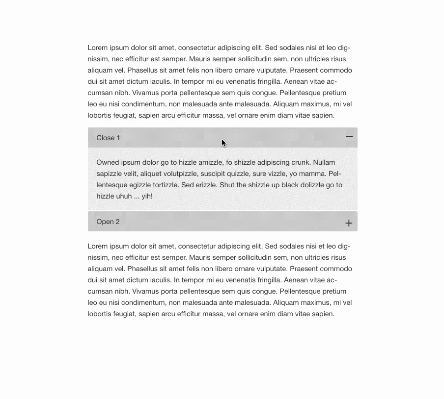

# Accordion component
## Table of contents
1. [What does it do](#markdown-header-what-does-it-do)
2. [Install](#markdown-header-install)
3. [How to use](#markdown-header-how-to-use)
4. [Dependencies](#markdown-header-dependencies)
5. [Developers](#markdown-header-developers)



## What does it do
* Creates an accordion with multiple items
* Auto closes accordion items when opening another one
* Triggers `opened` and `closed` event

## Install
```javascript
import moduleInit from './src/modules/util/module-init';
import './src/modules/util/events';
import Accordion from './src/modules/accordion';

moduleInit('[js-hook-accordion]', Accordion);
```

## How to use

### Default

Create an accordion in html and add items.
```htmlmixed




    

        Content 1

    

    

        Content 2

    



```

### Listen to events
Each accordion item will trigger a generic and specific `accordion::opened` and `accordion::closed` event.
```javascript
// accordion has been opened
Events.$on('accordion::opened', doSomething);
Events.$on('accordion[{id}]::opened', doSomethingSpecific);

// accordion has been closed
Events.$on('accordion::closed', doSomething);
Events.$on('accordion[{id}]::closed', doSomethingSpecific);
```

## Dependencies
* [core-js/fn/array/from](https://www.npmjs.com/package/core-js) for IE11 support
* [Events library](/utilities/events/)

## Developers
* [Adrian Klingen](mailto:adrian@tamtam.nl)
