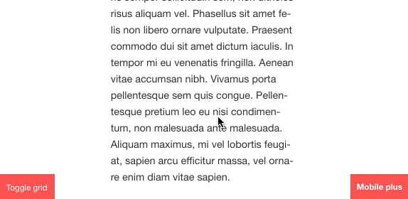

# Simple cookiebar component

## Table of contents
1. [What does it do](#markdown-header-what-does-it-do)
2. [Install](#markdown-header-install)
3. [How to use](#markdown-header-how-to-use)
4. [Dependencies](#markdown-header-dependencies)
5. [Developers](#markdown-header-developers)



## What does it do
* Simple cookiebar that closes when close is pressed.
* Automatically assumes users consent when being closed.

## Install

Install npm package dependency
```node
npm i js-cookie --save
```
Import module
```javascript
import moduleInit from './src/modules/util/module-init';
import Cookiebar from './src/modules/cookiebar';
moduleInit('[js-hook-cookiebar]', Cookiebar);
```

## How to use

### Default modal
Add cookiebar template to page

```htmlmixed

```

## Dependencies
* [Events component](/utilities/events/)
* [js-cookie](https://www.npmjs.com/package/js-cookie)

## Developers
* [Adrian Klingen](mailto:adrian@tamtam.nl)
* [Jeroen Reumkens (co author)](mailto:jeroen.reumkens@tamtam.nl)
