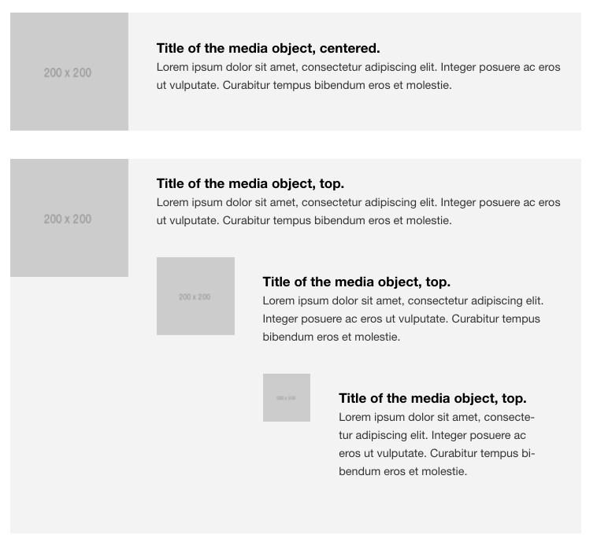

# Media

## Table of contents
1. [What does it do](#what-does-it-do)
2. [Install](#install)
3. [How to use](#how-to-use)
4. [Dependencies](#dependencies)
5. [Developers](#developers)



## What does it do
* Image component with HTML content next to it.

## Install
```htmlmixed

```

## How to use

```htmlmixed
 
    <p>HMTL content can be injected via caller.</p>

```

## Dependencies
* This component has no dependencies

## Developers
* [Jeroen Reumkens](mailto:jeroen.reumkens@tamtam.nl)
