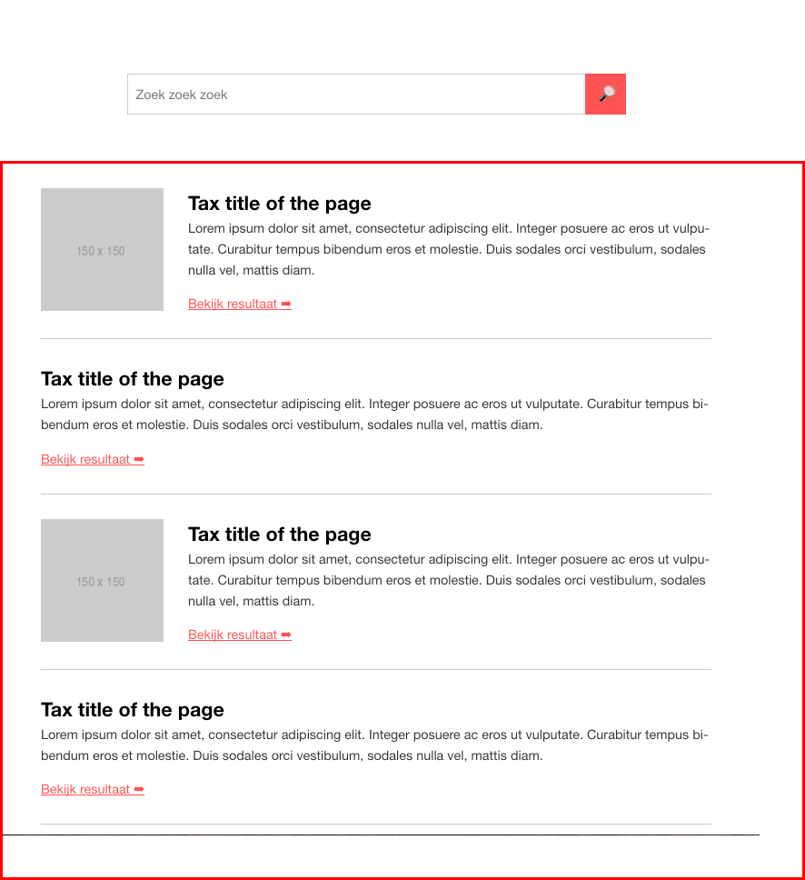

# Search

## Table of contents
1. [What does it do](#what-does-it-do)
2. [Install](#install)
3. [How to use](#how-to-use)
4. [Dependencies](#dependencies)
5. [Developers](#developers)



## What does it do
* Show a search field

## Install
```htmlmixed

```

## How to use

```htmlmixed
{{ searchField({
     action:        'string',
     submitText:    'string',
     id:            'string',
     autocomplete:  boolean     (optional, default false) - This is the browser autocomplete
     classes:       'string',   (optional)
     label:         'string',   (optional) - Also used as placeholder
     inputAttrs:    'string'    (optional)
}) }}
```

## Dependencies
This package doesn't have any dependencies.

## Developers
* [Jeroen Reumkens](mailto:jeroen.reumkens@tamtam.nl)
