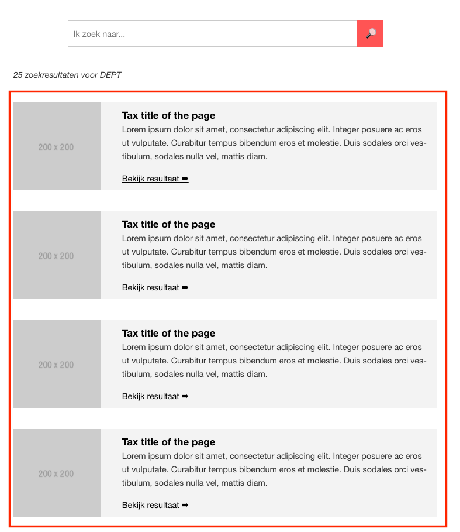

# Search results

## Table of contents
1. [What does it do](#what-does-it-do)
2. [Install](#install)
3. [How to use](#how-to-use)
4. [Dependencies](#dependencies)
5. [Developers](#developers)



## What does it do
* Show a list of search results

## Install
```htmlmixed

```

## How to use

```htmlmixed
{{ searchResults({
    viewResultsLabel: 'Bekijk resultaat ➡',
    results: [
        {
            title: 'Tax title of the page',
            description: 'Lorem ipsum dolor sit amet, consectetur adipiscing elit. Integer posuere ac eros ut vulputate. Curabitur tempus bibendum eros et molestie. Duis sodales orci vestibulum, sodales nulla vel, mattis diam.',
            url: '#',
            image: 'http://via.placeholder.com/150x150'
        },
        {
            title: 'Tax title of the page',
            description: 'Lorem ipsum dolor sit amet, consectetur adipiscing elit. Integer posuere ac eros ut vulputate. Curabitur tempus bibendum eros et molestie. Duis sodales orci vestibulum, sodales nulla vel, mattis diam.',
            url: '#'
        }
    ]
}) }}
```

## Dependencies
* [Teaser component](/components/teaser/)

## Developers
* [Jeroen Reumkens](mailto:jeroen.reumkens@tamtam.nl)
