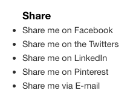

# Social sharing links

## Table of contents
1. [What does it do](#what-does-it-do)
2. [Install](#install)
3. [How to use](#how-to-use)
4. [Dependencies](#dependencies)
5. [Developers](#developers)



## What does it do
* Render share component with social media buttons
* Listen to click events and open a native window popup with share dialogue. Always shares the current page url.

## Install
Import module
```javascript
import '@/components/social-share';
```

## How to use
Include component in your template. Binding of clicks will be handles by the [Events component](/utilities/events/);
```htmlmixed

```

## Dependencies
* [Events component](/utilities/events/)

## Developers
* [Jeroen Reumkens](mailto:jeroen.reumkens@deptagency.com)
